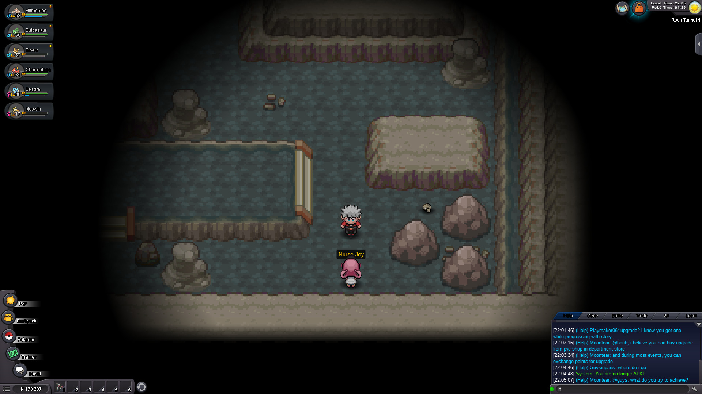

# PROAG

Pokemon Revolution Online Auto Grinder - This software allows you to grind your pokemon with minimum supervision.

Get [the game](https://pokemonrevolution.net/home).

## Topics

- [How it Works](#how-it-works)
- [Running the Code](#running-the-code)
  - [Configuring Your Grind](#configuring-your-grind)
- [Available Regions and Areas](#available-regions-and-areas)
  - [Kanto Region](#kanto-region)
    - [Rock Tunnel Area](#rock-tunnel-area)
- [Contributing](#contributing)
  - [Project Structure](#project-structure)
- [Why](#why)
- [Note](#note)

## How it Works

- If on Linux, please run as sudo.
- You have 5 seconds to focus the pokemon window
- Go to the specific route you want to grind at (**if the script has been added**)
- Do not unfocus the window while script is running
- Spam 'q' to stop the program execution

## Running the Code

1. Install the dependencies `pip3 install -r requirements.txt`
2. Install `tkinter` (installed with Python on Windows)
3. Open PROClient (the game)
4. Run the script: `python3 __init__.py <area> <sub-area>` or `sudo python3 __init__.py <area> <sub-area>` if on Linux. Example: `python3 __init__.py kanto rock_tunnel`. If no area is provided, it will default to rock tunnel.
5. You have 5 seconds to focus on the game for this script to work

### Configuring Your Grind

You can configure various parts of the code to change how you grind. Here are a few tips:

- `src/utils/globals.py` - Change things such as wait time between actions (`BANDWIDTH_WAIT`) or how many rounds your character should be fighting (`FIGHT_ROUNDS`) before moving again

Take a look at [Project Structure](#project-structure) if you want to create your own grind or configure an existing one to suit your needs.

## Available Regions and Areas

### Kanto Region

#### Rock Tunnel Area

- Command: `kanto rock_tunnel`
- Where: In the tunnel right before Lavender Town, directly in front of nurse Joy

## Contributing

Feel free to create a pull request with new regions and areas where we can grind!

### Project Structure

- `__init__.py` - Entry point of the application
- `requirements.txt` - Project PIP requirements
- `assets/` - Images, usually those used to display at what location a grind can be initiated
- `src/` - Project source code
  - `__init__.py` - Project `main()` function (first function to run), initiates everything
  - `region/` - Region **grinding** code
    - `<region>/` - Specific region where this code is used in
      - `<area>.py` - Grinding code used in that area of the game. Primary function should be called `run()`, for the sake of consistency.
  - `run/` - This folder contains the code to run any of the of the region code.
    - `<area>.py` - Filters the area in the region and run its code (which can be found in `src/region/<region>/<area>.py`)
  - `utils/` - All auxiliary functions
    - `__init__.py` - General utility functions that can be used in the whole project
    - `actions.py` - Common actions the player can take that does not change anywhere
    - `globals.py` - Global variables
    - `move.py` - Functions to move the player around
    - `parser.py` - Parse inputs

## Why

Personal project, I just hate grinding lol

## NOTE

Please read the license before using the software.
